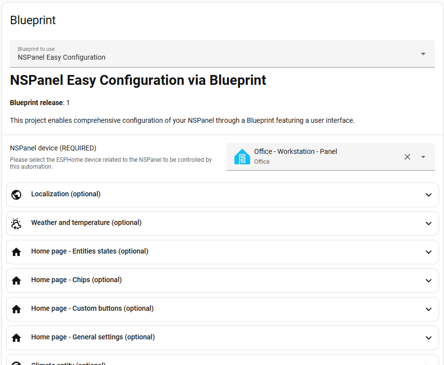

# NSPanel Easy

[![Version][version-shield]][version]
[![GitHub Activity][commits-shield]][commits]
[![GitHub Last Commit][last-commit-shield]][commits]
[![Platform][platform-shield]](https://github.com/esphome)
[![Discord][discord-shield]][discord]
[![Buy me an ice cream][buymeacoffee-shield]](https://www.buymeacoffee.com/edwardfirmo)

A powerful, code-free customization platform for the Sonoff NSPanel,
built on [ESPHome](https://esphome.io/) and [Home Assistant](https://www.home-assistant.io/).
Configure every aspect of your panel through an intuitive Blueprint UI - no programming required.

> [!TIP]
> **Coming from [Blackymas/NSPanel_HA_Blueprint](https://github.com/Blackymas/NSPanel_HA_Blueprint)?**
> Migrating takes less than 10 minutes - no serial flashing, no reconfiguration.
> Follow our [Migration Guide](docs/migration_from_blackymas.md) to get started.

*If this project makes your smart home a little smarter,
consider [buying me an ice cream][buymeacoffee] - it fuels the late-night coding sessions!* 🍦

<!-- markdownlint-disable MD013 -->

<!-- markdownlint-enable MD013 -->

## Table of Contents

1. [Project Highlights](#project-highlights)
2. [Prerequisites](#prerequisites)
3. [Where to Buy](#where-to-buy)
4. [Architecture](#architecture)
5. [Documentation & Resources](#documentation--resources)
6. [Features](#features)
7. [Pages Overview](#pages-overview)
8. [Home Assistant Integration](#home-assistant-integration)
9. [Contributing](#contributing)
10. [Community & Support](#community--support)
11. [Acknowledgements](#acknowledgements)
12. [Fonts and Licensing](#fonts-and-licensing)
13. [Donations](#donations)

## Project Highlights

- **No Coding Required:** Customize your NSPanel entirely through a Home Assistant Blueprint UI.
- **Quick Setup:** Get your panel up and running in minutes with a guided graphical interface.
- **Fully Local:** All control stays local - no cloud dependencies, no internet required after setup.
- **Modular Architecture:** Include only the packages you need, keeping firmware lean and efficient.
- **Community-Driven:** Built by the community, for the community. Your feedback and contributions shape every release.

## Prerequisites

- **Home Assistant** - a running instance (see [home-assistant.io](https://www.home-assistant.io/))
- **ESPHome** - installed as a Home Assistant add-on or standalone (see [esphome.io](https://esphome.io/))
- **Sonoff NSPanel** - EU or US model (original, not NSPanel Pro)

> [!NOTE]
> This project uses the **ESP-IDF** framework exclusively.
> Arduino framework support has been deprecated and is no longer maintained.

## Where to Buy

Need a Sonoff NSPanel? Our [Where to Buy](docs/where_to_buy.md) guide lists retailers
across multiple regions — including affiliate links that support this project at no
extra cost to you, and pre-flashed options for those who prefer a ready-to-go setup.

## Architecture

NSPanel Easy comprises three tightly integrated components that work together:

| Component | Description |
| --- | --- |
| **ESPHome Firmware** | Runs on the ESP32 inside the NSPanel, handling communication, sensors, relays, and display control. |
| **Nextion TFT** | The display firmware loaded onto the Nextion screen, defining all UI pages and touch interactions. |
| **HA Blueprint** | A Home Assistant automation blueprint that orchestrates the panel's behavior and entity bindings. |

> [!NOTE]
> Each component is versioned independently and designed to be compatible across releases.
> You do not need to update all three at once - update each at your own pace as new versions become available.

## Documentation & Resources

Full documentation lives in the [docs/](docs/README.md) folder — also published
as a browsable site at [edwardtfn.github.io/NSPanel-Easy](https://edwardtfn.github.io/NSPanel-Easy/).
The Manuals page indexes every guide available.

Quick links for the most common needs:

- **Getting Started:** [Installation and Setup](docs/install.md) walks you
  through flashing, TFT upload, and Blueprint import.
- **Migrating from Blackymas?** The [Migration Guide](docs/migration_from_blackymas.md)
  takes less than 10 minutes — no serial flashing required.
- **API Reference:** [API Documentation](docs/api.md) for all custom ESPHome
  actions.
- **Troubleshooting:** [TFT Upload](docs/tft_upload.md) ·
  [Compiling Errors](docs/error_compiling.md) ·
  [Panel Startup Issues](docs/error_initializing.md).
- **Feature Requests:** [Open a new feature request](https://github.com/edwardtfn/NSPanel-Easy/labels/new%20feature%20request) to share your ideas.
- **Changelog:** Every merged PR automatically generates a [GitHub Release](https://github.com/edwardtfn/NSPanel-Easy/releases) with detailed notes.

## Features

### Display & Navigation

- Swipe navigation between all pages
- Quick-access swipe (up/down) to jump to specific pages
- Top status bar with up to 10 configurable indicator icons
- Adjustable display brightness and dim brightness
- Screensaver / sleep mode support
- Notification overlay with custom messages
- QR code display for Wi-Fi sharing or custom URLs

### Buttons & Entities

- Up to 32 buttons across 4 button pages with long-press support
- Up to 32 entities across 4 entity pages with customizable icons, labels, and value alignment
- Automatic icon and layout generation based on entity type
- Real-time brightness and cover position displayed directly on buttons
- Long-press detection for light, cover, fan, media player, alarm, and climate sub-menus

### Climate & Environmental

- Full thermostat control with target temperature slider
- Support for all standard Home Assistant climate modes (`heat`, `cool`, `auto`, `dry`, `fan`)
- Optional [local relay control](docs/addon_climate.md) for floor heating - works even without Wi-Fi
- Weather forecast with up to 5 days of data (rain probability, UV index, wind speed, and more)

### Media & Entertainment

- Media player page with playback controls, volume, and track information
- Support for play/pause, next/previous track, shuffle, repeat, and source selection

### Security

- Alarm control panel with arm/disarm modes
- Numeric keypad for PIN-protected arming and disarming

### Utilities

- Energy and utilities dashboard with up to 6 configurable groups
- Real-time values with directional flow indicators (e.g., grid import/export)

### Hardware

- 2 physical relay switches with optional fallback mode
- Built-in temperature sensor with calibration support
- Buzzer for audible feedback and RTTTL melody playback

## Pages Overview

### Home

- Current weather with quick access to the forecast page
- Freely assignable hardware button labels and actions
- Visual state indicator (blue line) for entity on/off status
- Outside temperature, room temperature, and room humidity
- Up to 3 user-selectable entities
- Status icons along the top bar

### Button Pages

- Up to 8 buttons per page across 4 pages (32 total)
- Auto-generated button design based on entity type
- Brightness and cover position shown on the button itself
- Customizable labels via the Blueprint
- Long-press opens detailed sub-menus for supported domains

### Entity Pages

- Up to 8 entities per page across 4 pages (32 total)
- Individually configurable icons and labels (or auto-detected)
- Flexible value alignment options

### Light Settings

- Current light state and brightness slider
- RGB color wheel for color selection
- Color temperature slider
- Effect selector for lights that support effects
- Quick navigation back to the originating button page

### Cover Settings

- Open and close controls
- Position slider for precise adjustment
- Battery value display (when available)

### Climate / Thermostat

- Target temperature slider
- Current temperature reading
- 4 user-selectable value slots (e.g., water temperature, outdoor sensor)
- Standard Home Assistant climate mode buttons
- 2 user-selectable action buttons

### Media Player

- Playback state and controls (play, pause, stop, next, previous)
- Volume slider with mute toggle
- Current track title and artist
- Media progress bar

### Fan Speed

- On/off toggle
- Speed control via slider or step buttons

### Alarm

- Arm/disarm with all standard Home Assistant alarm modes
- Numeric keypad for PIN entry

### Weather Forecast

- 5-day forecast with swipe navigation
- Min/max temperatures and date display
- Additional parameters: rain probability, sunshine hours, UV index, thunderstorm probability, wind speed

### Utilities Dashboard

- Energy flow dashboard with grid, home consumption, and up to 6 custom groups
- Real-time value updates with directional indicators

### Settings

Accessible via long-press on the time area of the Home page:

- Restart the NSPanel
- Display brightness slider
- Display dim brightness slider

### Boot

## Home Assistant Integration

### Device Page

On the device page under **Devices & Services**, you can view and configure:

### Blueprint Configuration

The Blueprint provides a visual interface for defining what appears on your panel and how it behaves:

## Contributing

We welcome contributions of all kinds - code, documentation, translations, and testing.

- **Pull Requests:** Open a PR against `main`. Each PR gets its own branch for development and review.
- **Testing:** Browse [open Pull Requests](https://github.com/edwardtfn/NSPanel-Easy/pulls) to find features that need testing and feedback.
- **Issues:** Report bugs or request features via [GitHub Issues](https://github.com/edwardtfn/NSPanel-Easy/issues).
- **Discussions:** Join the conversation on [Discord][discord].

> [!TIP]
> Not a developer? You can still help by improving documentation, translating strings, testing open PRs,
> or [buying me an ice cream][buymeacoffee] 🍦

## Community & Support

Whether you need help, want to share your setup, or just want to follow along - we'd love to have you.

- **[GitHub Issues & Feature Requests](https://github.com/edwardtfn/NSPanel-Easy/issues)**
- **[Discord Server][discord]**

## Acknowledgements

A huge thank you to everyone who has contributed to making this project a reality.
Your feedback, testing, and code contributions have been invaluable.

Special thanks to the projects that inspired and informed this work:

- [Blackymas](https://github.com/Blackymas/NSPanel_HA_Blueprint) - the original repository from which this project is derived
- [Hellis81](https://github.com/Hellis81/NS-panel)
- [Jimmyboy83](https://github.com/Jimmyboy83/nspanel)
- [joBr99](https://github.com/joBr99/Generate-HASP-Fonts)
- [lovejoy77](https://github.com/lovejoy777/NSpanel)
- [Marcfager](https://github.com/marcfager/nspanel-mf)
- [Masto](https://github.com/masto/NSPanel-Demo-Files)
- [sairon](https://github.com/sairon/esphome-nspanel-lovelace-ui)
- [SmartHome Yourself](https://www.youtube.com/c/SmarthomeyourselfDe_DIY)

## Fonts and Licensing

NSPanel Easy bundles the following fonts in its display firmware.
Each font is used in accordance with its respective license,
and the full license texts are included in the [`licenses/`](licenses/) directory.

### Sarasa Gothic

Used for all display text, icon companion glyphs, and page indicators.

- Source: [be5invis/Sarasa-Gothic](https://github.com/be5invis/Sarasa-Gothic)
- License: [SIL Open Font License 1.1](licenses/Sarasa-OFL-1.1.txt)
- Copyright: Renzhi Li (Belleve Invis), with portions from Adobe Source Han Sans and Iosevka

### Material Design Icons

Used for all UI icons displayed alongside text on the panel.

- Source: [Pictogrammers Material Design Icons](https://pictogrammers.com/library/mdi/)
- License: [Apache License 2.0](licenses/MDI-Apache-2.0.mdx)
- Copyright: Pictogrammers and contributors

## Donations

This project is built with love and maintained in my spare time.
If NSPanel Easy has made your life easier,
consider [buying me an ice cream][buymeacoffee] - every scoop keeps the project going! 🍦

<!-- Link References -->
[version-shield]: https://img.shields.io/github/v/release/edwardtfn/NSPanel-Easy?label=version
[version]: https://github.com/edwardtfn/NSPanel-Easy/releases/latest

[commits-shield]: https://img.shields.io/github/commit-activity/y/edwardtfn/NSPanel-Easy
[commits]: https://github.com/edwardtfn/NSPanel-Easy/commits/main

[last-commit-shield]: https://img.shields.io/github/last-commit/edwardtfn/NSPanel-Easy

[platform-shield]: https://img.shields.io/badge/platform-Home%20Assistant%20&%20ESPHome-blue

[discord-shield]: https://img.shields.io/discord/1464682227068698724?logo=discord
[discord]: https://discord.gg/KyVPd33znv

[buymeacoffee-shield]: https://img.shields.io/static/v1?label=Buy%20me%20an%20ice%20cream&message=❄&color=blue
[buymeacoffee]: https://www.buymeacoffee.com/edwardfirmo
