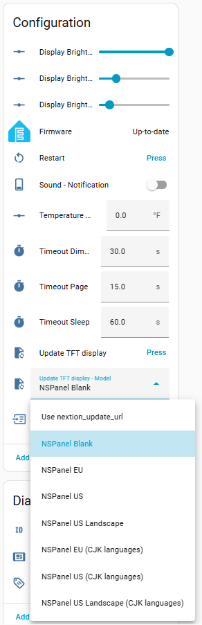

# NSPanel Blank - First TFT Installation

The NSPanel consists of an ESP32 board (the panel itself, controlling the relays, buttons, communications, etc.)
with a Nextion display connected to it.

This Nextion display has an independent controller which also requires a firmware and its settings (the basic layout),
and this is done by a `.tft` file.

When you get your panel from Sonoff, their `tft` file is installed in the Nextion display using a so-called "Reparse mode",
which makes it a bit challenging to replace the `tft` file when using ESPHome.
We highly recommend selecting **NSPanel Blank** as your first upload (this is the default for new installations),
as it is just a fraction of the size of a regular `tft` file and will make the first replacement much easier.

Once the NSPanel's original `tft` is replaced, it is much easier to install a new `tft` with ESPHome,
so you can proceed directly to installing the final file
(e.g., **NSPanel EU**, **NSPanel US**, **NSPanel US Landscape**, or one of the **CJK languages** variants).

For more details on how to install the first `tft` file, especially if your panel is still displaying the original Sonoff screen,
please refer to the [Troubleshooting TFT transfer](tft_upload.md) guide.

## How to install a different `tft` file?

Go to your device's page (under **Settings** > **Devices & services** > **ESPHome**),
select your **Upload TFT display - Model** and then press **Upload TFT display**.

## What to do after installing **NSPanel Blank**?

Once you have successfully installed any of the `tft` files from this project,
the **NSPanel Blank** model shouldn't be necessary anymore and you should be able to always install the final `tft` file directly.

Follow the same steps described above, but now select the correct final regional model
(e.g., **NSPanel EU**, **NSPanel US**, **NSPanel US Landscape**, or one of the **CJK languages** variants)
before pressing **Upload TFT display**.
Double-check this selection to avoid flashing the wrong region.

## Additional Tips and Resources

We have a useful guide for [troubleshooting TFT transfer issues](tft_upload.md).
Please take a look there first.

After troubleshooting, if issues persist, consult the [Issues](https://github.com/edwardtfn/NSPanel-Easy/issues)
and feel free to create a new one asking for more personalized assistance.

Please share as much info as possible, like:

1. A description (or picture) of what is on your screen.
2. Whether you are updating from a previous version of this same project,
   coming from another NSPanel customization (if so, which one?),
   or customizing for the first time a panel with original Sonoff settings.
3. The ESPHome logs from when your panel starts to the moment the upload fails.
4. A description of what you have already tried.

## Important note

Remember, these steps are a guideline and might vary slightly based on your specific setup and previously installed system.
