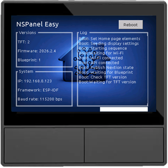
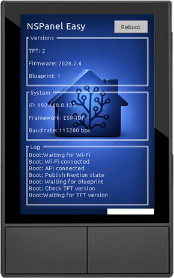

# Nextion instructions used for screenshots

Please select "Instruction codes: utf-8" in the Nextion simulator

## Boot page

```nextion
page boot
log_scroll.en=0
tm_esphome.en=0
ver_firmware.txt="Firmware: 2026.2.4"
ver_blueprint.txt="Blueprint: 1"
sys_ip.txt="IP: 192.168.0.123"
sys_framework.txt="Framework: ESP-IDF"
sys_baudrate.txt="Baud rate: 115200 bps"
log_body.txt="Boot: Set Home page elements\r"
log_body.txt+="Boot: Sending display settings\r"
log_body.txt+="Boot: Starting sequence\r"
log_body.txt+="Boot: Waiting for Wi-Fi\r"
log_body.txt+="Boot: Wi-Fi connected\r"
log_body.txt+="Boot: API connected\r"
log_body.txt+="Boot: Publish Nextion state\r"
log_body.txt+="Boot: Waiting for Blueprint\r"
log_body.txt+="Boot: Check TFT version\r"
log_body.txt+="Boot:Waiting for TFT version\r"
progress.val=65
```





## Home page

**EU version:**

```nextion
page home
bt_entities.txt=""
bt_notific.txt=""
bt_qrcode.txt=""
button01.txt=""
button02.txt=""
button03.txt=""
button07.pco=19818
button07.txt=""
chip01.pco=64164
chip01.txt=""
chip03.txt=""
chip05.txt="侀"
chip_relay1.txt=""
date.txt="Sunday, November 29"
indr_temp_icon.txt=""
indr_temp.txt="21.6 °C"
left_bt_text.txt="Ceiling lights"
meridiem.txt="PM"
outdoor_temp.txt="18.9°C"
right_bt_text.txt="Desk lights"
time.txt="12:34"
value01_icon.txt=""
value01.txt="47%"
value03_icon.txt=""
value03.txt="715 W"
weather.pic=11
wifi_icon.txt=""
vis bt_entities,1
vis bt_notific,1
vis bt_qrcode,1
vis button01,1
vis button02,1
vis button03,1
vis button07,1
vis indr_temp,1
vis indr_temp_icon,1
vis value01,1
vis value01_icon,1
vis value03,1
vis value03_icon,1
vis wifi_icon,1
```


**US version:**

```nextion
page home
meridiem.txt="PM"
date.txt="Sunday, 11/29"
outdoor_temp.txt="48°"
time.txt="12:34"
vis wifi_icon,1
wifi_icon.txt=""
weather.pic=11
left_bt_text.txt="Ceiling lights"
left_bt_pic.pic=32
icon_top_01.txt=""
right_bt_text.txt="Desk lights"
icon_top_03.txt=""
icon_top_03.pco=64164
icon_top_06.txt=""
icon_top_08.txt="侀"
current_temp.txt="71 °F"
indoortempicon.txt=""
value01_state.txt="47%"
value01_icon.txt=""
bt_notific.txt=""
vis bt_notific,1
bt_qrcode.txt=""
vis bt_qrcode,1
bt_entities.txt=""
vis bt_entities,1
bt_alarm.txt=""
bt_alarm.pco=19818
vis bt_alarm,1
button01.txt=""
button02.txt=""
button03.txt=""
value03_state.txt="715 W"
value03_icon.txt=""
```


## Settings page

```nextion
page settings
```


## Buttons pages (DRAFT)

```nextion
api=1
page buttonpage01
page_label.txt="Bedroom"
vis 255,1
button01pic.picc=47
button01text.picc=47
button01icon.picc=47
button01bri.picc=47
button01text.txt="Ceiling\rlights"
button01text.pco=10597
button01icon.txt=""
button01icon.pco=64704
button01icon.font=10
button01bri.txt="100%"
button01bri.pco=10597
button02pic.picc=46
button02text.picc=46
button02icon.picc=46
button02bri.picc=46
button05pic.picc=47
button05text.picc=47
button05icon.picc=47
button05bri.picc=47
button05text.txt="Windows\rlights"
button05text.pco=10597
button05icon.txt=""
button05icon.pco=64704
button05icon.font=8
button05bri.txt="100%"
button05bri.pco=10597
button06pic.picc=46
button06text.picc=46
button06icon.picc=46
button06bri.picc=46
```

## Entities pages

**EU version:**

```nextion
api=1
page entitypage01
entity01_label.txt="Power monitoring"
value01_pic.txt=""
value01_label.txt="Kitchen"
value01.txt="1123.1 W"
value01.xcen=2
value02_pic.txt=""
value02_label.txt="Living room"
value02.txt="233.1 W"
value02.xcen=2
value03_pic.txt=""
value03_label.txt="Total (entire home)"
value03.txt="2345.6 W"
value03.xcen=2
value05_pic.txt=""
value05_label.txt="Electricity price"
value05.txt="1.21 €/kWh"
value05.xcen=2
value07_pic.txt=""
value07_label.txt="Electricity cost rate"
value07.txt="1.84 €/h"
value07.xcen=2
```

**US version:**

```nextion
api=1
page entitypage01
entity01_label.txt="Power monitoring"
value01_pic.txt=""
value01_label.txt="Kitchen"
value01.txt="1123.1 W"
value01.xcen=2
value02_pic.txt=""
value02_label.txt="Living room"
value02.txt="233.1 W"
value02.xcen=2
value03_pic.txt=""
value03_label.txt="Total (home)"
value03.txt="2345.6 W"
value03.xcen=2
value05_pic.txt=""
value05_label.txt="Price"
value05.txt="1.21 $/kWh"
value05.xcen=2
value07_pic.txt=""
value07_label.txt="Cost rate"
value07.txt="1.84 $/h"
value07.xcen=2
```

## Sensor page (mockup)

```nextion
api=1
page notification
vis bt_accept,0
vis bt_clear,0
notifi_label.txt="My sensor name"
notifi_text01.txt="1115.4 kWh"
notifi_text01.font=6
```

## Light page

For screenshots captured in the simulator, set `display_mode` explicitly
because the simulator has no EEPROM to read from.
Replace `hard_coded_display_mode` with the value matching your target build:
`1` for EU landscape, `2` for US portrait, `3` for US landscape.

```nextion
api=1
display_mode=hard_coded_display_mode
page light
back_page_id=0
lightslider.val=100
light_value.txt="100%"
light_value_2.txt="100%"
page_label.txt="Kitchen lights"
icon_state.txt=""
vis lightslider,1
vis color_button,1
vis color_touch,1
vis effect_button,1
```


## Light effect selector

Shows the effect picker overlaid on top of the light page.
The light page is constructed first, then the popup_select page is
populated with eight effect options and Pulse highlighted as the
current selection.

```nextion
api=1
display_mode=hard_coded_display_mode
page light
back_page_id=0
lightslider.val=100
light_value.txt="100%"
light_value_2.txt="100%"
page_label.txt="Kitchen lights"
icon_state.txt=""
vis lightslider,1
vis color_button,1
vis color_touch,1
vis effect_button,1
doevents
delay 1000
page popup_select
caller_page_id.val=10
select_mode.val=0
opt_count.val=8
total_count.val=8
selection_mask.val=8
lbl_title.txt="Select effect"
opt0.txt="None"
opt1.txt="Rainbow"
opt2.txt="Fireplace"
opt3.txt="Pulse"
opt4.txt="Strobe"
opt5.txt="Candle"
opt6.txt="Police"
opt7.txt="Party"
init.en=1
```


